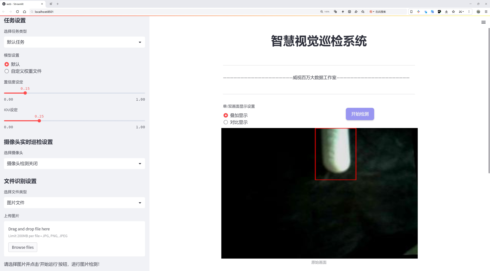

# 药品识别与分类检测系统源码分享
 # [一条龙教学YOLOV8标注好的数据集一键训练_70+全套改进创新点发刊_Web前端展示]

### 1.研究背景与意义

项目参考[AAAI Association for the Advancement of Artificial Intelligence](https://gitee.com/qunshansj/projects)

项目来源[AACV Association for the Advancement of Computer Vision](https://gitee.com/qunmasj/projects)

研究背景与意义

随着全球人口老龄化和慢性疾病的增加，药品的使用频率不断上升，药品管理和识别的重要性愈发凸显。药品的正确识别与分类不仅关系到患者的用药安全，也对药品的流通管理、库存控制以及临床决策支持等方面产生深远影响。传统的药品识别方法多依赖于人工检查和经验判断，效率低下且容易出错。因此，开发一种高效、准确的药品识别与分类系统显得尤为重要。

近年来，深度学习技术的迅猛发展为图像识别领域带来了革命性的变化，尤其是目标检测算法的进步，使得计算机能够以更高的精度和速度进行物体识别。在众多目标检测算法中，YOLO（You Only Look Once）系列模型因其实时性和高效性而受到广泛关注。YOLOv8作为该系列的最新版本，具备了更强的特征提取能力和更快的推理速度，适合在复杂的药品识别场景中应用。然而，现有的YOLOv8模型在特定药品识别任务中的应用仍存在一定的局限性，尤其是在处理多类别药品时的准确性和鲁棒性。

本研究旨在基于改进的YOLOv8模型，构建一个高效的药品识别与分类系统。为此，我们将使用一个包含1500张图像的药品数据集，该数据集涵盖了9个类别，包括C、LIP、Pills、VINEGAR、ace、air、centrum、iron和mag等。这些类别的药品在日常生活中广泛使用，具有较高的实际应用价值。通过对这些药品图像的深度学习训练，我们期望能够提升模型在多类别药品识别中的表现，进而为药品管理提供技术支持。

本研究的意义不仅在于提升药品识别的准确性和效率，更在于推动智能医疗和药品管理的数字化转型。通过构建一个基于改进YOLOv8的药品识别与分类系统，我们可以为医疗机构、药品零售商及相关监管部门提供一种智能化的解决方案，帮助他们更好地管理药品信息，减少人工操作带来的错误风险。此外，该系统还可以为患者提供便捷的用药指导，提升用药安全性。

总之，基于改进YOLOv8的药品识别与分类系统的研究不仅具有重要的学术价值，也具有广泛的社会应用前景。随着智能技术的不断进步，药品识别与分类的智能化将为提升医疗服务质量、保障患者用药安全以及推动药品行业的可持续发展提供强有力的支持。

### 2.图片演示





##### 注意：由于此博客编辑较早，上面“2.图片演示”和“3.视频演示”展示的系统图片或者视频可能为老版本，新版本在老版本的基础上升级如下：（实际效果以升级的新版本为准）

  （1）适配了YOLOV8的“目标检测”模型和“实例分割”模型，通过加载相应的权重（.pt）文件即可自适应加载模型。

  （2）支持“图片识别”、“视频识别”、“摄像头实时识别”三种识别模式。

  （3）支持“图片识别”、“视频识别”、“摄像头实时识别”三种识别结果保存导出，解决手动导出（容易卡顿出现爆内存）存在的问题，识别完自动保存结果并导出到tempDir中。

  （4）支持Web前端系统中的标题、背景图等自定义修改，后面提供修改教程。

  另外本项目提供训练的数据集和训练教程,暂不提供权重文件（best.pt）,需要您按照教程进行训练后实现图片演示和Web前端界面演示的效果。

### 3.视频演示

[3.1 视频演示](https://www.bilibili.com/video/BV1BzpxeQECK/)

### 4.数据集信息展示

##### 4.1 本项目数据集详细数据（类别数＆类别名）

nc: 8
names: ['C', 'LIP', 'VINEGAR', 'ace', 'air', 'centrum', 'iron', 'mag']


##### 4.2 本项目数据集信息介绍

数据集信息展示

在现代药品识别与分类系统的研究中，数据集的质量和多样性直接影响到模型的性能和准确性。本研究所采用的数据集名为“8-pill-combin”，该数据集专门为改进YOLOv8模型在药品识别与分类任务中的应用而设计。通过精心构建和整理，该数据集涵盖了八个不同的药品类别，旨在为模型提供丰富的训练样本，以提高其在实际应用中的识别能力和分类精度。

“8-pill-combin”数据集的类别数量为8，具体类别包括：C、LIP、VINEGAR、ace、air、centrum、iron和mag。这些类别代表了不同类型的药品或补充剂，涵盖了从维生素到矿物质的多种产品。每个类别都经过严格的标注和分类，以确保数据的准确性和一致性。例如，类别“C”可能代表维生素C，而“LIP”则可能指代某种润唇膏或唇部护理产品。这种多样化的类别设置不仅能够帮助模型学习到不同药品的特征，还能增强其在复杂场景下的识别能力。

数据集中的样本图像经过精心挑选，确保每个类别的样本在数量和质量上都达到一定的标准。图像的拍摄环境、光照条件和角度各异，旨在模拟真实世界中药品的多样性和复杂性。这种多样化的样本设置使得模型在训练过程中能够更好地适应不同的环境变化，从而提升其在实际应用中的鲁棒性。此外，数据集中还包含了多种背景和场景，以增强模型对药品识别的全面性和准确性。

在数据集的构建过程中，标注工作同样至关重要。每个图像都经过专业人员的标注，确保每个药品类别的准确性和一致性。这种高质量的标注不仅提高了数据集的可信度，也为后续的模型训练提供了坚实的基础。通过使用“8-pill-combin”数据集，研究者能够充分利用这些高质量的标注数据，进行深入的模型训练和优化。

为了进一步提升YOLOv8模型在药品识别与分类任务中的表现，研究者们还计划对数据集进行扩展和增强。这可能包括引入更多的药品类别、增加样本数量以及进行数据增强处理，以模拟不同的拍摄条件和背景。这种扩展不仅能够提高模型的泛化能力，还能为未来的研究提供更多的可能性。

总之，“8-pill-combin”数据集在药品识别与分类系统的研究中扮演着至关重要的角色。通过提供多样化的类别和高质量的样本，该数据集为改进YOLOv8模型的训练提供了坚实的基础。随着研究的深入和数据集的不断扩展，期待该系统能够在药品识别领域取得更大的突破，为公众健康和安全做出贡献。


### 5.全套项目环境部署视频教程（零基础手把手教学）

[5.1 环境部署教程链接（零基础手把手教学）](https://www.ixigua.com/7404473917358506534?logTag=c807d0cbc21c0ef59de5)


[5.2 安装Python虚拟环境创建和依赖库安装视频教程链接（零基础手把手教学）](https://www.ixigua.com/7404474678003106304?logTag=1f1041108cd1f708b01a)

### 6.手把手YOLOV8训练视频教程（零基础小白有手就能学会）

[6.1 手把手YOLOV8训练视频教程（零基础小白有手就能学会）](https://www.ixigua.com/7404477157818401292?logTag=d31a2dfd1983c9668658)

### 7.70+种全套YOLOV8创新点代码加载调参视频教程（一键加载写好的改进模型的配置文件）

[7.1 70+种全套YOLOV8创新点代码加载调参视频教程（一键加载写好的改进模型的配置文件）](https://www.ixigua.com/7404478314661806627?logTag=29066f8288e3f4eea3a4)

### 8.70+种全套YOLOV8创新点原理讲解（非科班也可以轻松写刊发刊，V10版本正在科研待更新）

由于篇幅限制，每个创新点的具体原理讲解就不一一展开，具体见下列网址中的创新点对应子项目的技术原理博客网址【Blog】：


[8.1 70+种全套YOLOV8创新点原理讲解链接](https://gitee.com/qunmasj/good)

### 9.系统功能展示（检测对象为举例，实际内容以本项目数据集为准）

图9.1.系统支持检测结果表格显示

  图9.2.系统支持置信度和IOU阈值手动调节

  图9.3.系统支持自定义加载权重文件best.pt(需要你通过步骤5中训练获得)

  图9.4.系统支持摄像头实时识别

  图9.5.系统支持图片识别

  图9.6.系统支持视频识别

  图9.7.系统支持识别结果文件自动保存

  图9.8.系统支持Excel导出检测结果数据


### 10.原始YOLOV8算法原理

原始YOLOv8算法原理

YOLOv8算法作为目标检测领域的一项重要进展，延续了YOLO系列算法的优良传统，同时在多个方面进行了创新和优化。其核心思想是通过高效的网络结构和改进的损失函数，提升目标检测的精度和速度。YOLOv8在设计上遵循了“快速、准确、易用”的原则，使其成为各种计算机视觉任务的理想选择。

在网络结构方面，YOLOv8依然采用了跨级结构（Cross Stage Partial, CSP）的设计理念，这一结构旨在通过分流和合并的方式提高特征提取的效率。与前一版本YOLOv5相比，YOLOv8对C3模块进行了优化，替换为更轻量的C2F模块。C2F模块通过并行化更多的梯度流分支，确保在轻量化的同时，能够获取更丰富的特征信息。这种设计不仅提高了模型的精度，还有效降低了计算延迟，使得YOLOv8在处理复杂场景时表现得更加出色。

YOLOv8的特征融合层采用了特征金字塔网络（FPN）与路径聚合网络（PAN）的结合，进一步增强了不同尺度特征的提取能力。为了提高模型的灵活性和效率，YOLOv8在特征融合网络中引入了BiFPN（Bidirectional Feature Pyramid Network），这种网络结构通过高效的双向跨尺度连接和加权特征融合，优化了特征信息的流动，确保了不同尺度目标的检测精度。

在检测头部分，YOLOv8进行了重大改进，采用了解耦头（Decoupled Head）结构，分别处理目标检测和分类任务。与YOLOv5的耦合头不同，YOLOv8的解耦头将输入特征图通过两个1×1的卷积模块降维，分别为目标类别和边界框位置进行预测。这种设计使得模型在处理复杂场景时，能够更好地聚焦于目标的特征，提升了检测的准确性。

YOLOv8在损失函数的设计上也进行了创新，采用了变焦损失（Focal Loss）来计算分类损失，同时结合数据平均保真度损失和完美交并比损失（CIoU Loss）来优化边界框的回归。这种新的损失策略使得模型在训练过程中能够更有效地聚焦于难以检测的目标，提升了整体的检测性能。

输入部分的设计同样体现了YOLOv8的创新思路。默认的输入图像尺寸为640×640，但在实际应用中，YOLOv8采用自适应图片缩放的方式，以提高目标检测的速度和准确性。这种方法通过将长边按比例缩小到指定尺寸，然后对短边进行填充，尽量减少信息冗余，从而提升了模型的性能。此外，YOLOv8在训练过程中引入了Mosaic图像增强操作，通过随机拼接多张图像，迫使模型学习不同位置和周围像素的特征，从而有效提高了模型的泛化能力。

YOLOv8的设计理念不仅体现在网络结构的优化上，还包括对目标检测任务的理解和处理方式的创新。通过将目标检测转化为关键点检测，YOLOv8抛弃了传统的锚框（Anchor-Based）方法，采用了无锚框（Anchor-Free）的方法。这一转变使得模型在训练过程中不再依赖于预设的锚框参数，提升了模型的灵活性和泛化能力。无锚框的方法简化了网络结构，减少了计算复杂度，使得YOLOv8在处理多样化目标时更加高效。

综上所述，YOLOv8算法通过一系列创新的设计和优化，提升了目标检测的精度和速度。其轻量化的特征提取网络、灵活的特征融合方式、解耦的检测头结构以及新的损失策略，使得YOLOv8在目标检测任务中表现出色。随着YOLOv8的不断发展和应用，其在计算机视觉领域的潜力将会进一步被挖掘，为各种实际应用提供强有力的支持。


### 11.项目核心源码讲解（再也不用担心看不懂代码逻辑）

#### 11.1 70+种YOLOv8算法改进源码大全和调试加载训练教程（非必要）\ultralytics\utils\loss.py

以下是经过精简和注释的核心代码部分，主要包含了损失函数的实现，特别是与目标检测和关键点检测相关的损失函数。注释详细解释了每个类和方法的功能。

```python
import torch
import torch.nn as nn
import torch.nn.functional as F

class SlideLoss(nn.Module):
    """
    Slide Loss 类，基于给定的损失函数对每个元素应用滑动损失。
    """
    def __init__(self, loss_fcn):
        super(SlideLoss, self).__init__()
        self.loss_fcn = loss_fcn
        self.reduction = loss_fcn.reduction
        self.loss_fcn.reduction = 'none'  # 需要对每个元素应用滑动损失

    def forward(self, pred, true, auto_iou=0.5):
        """
        计算滑动损失。
        :param pred: 预测值
        :param true: 真实值
        :param auto_iou: 自动IoU阈值
        :return: 计算后的损失
        """
        loss = self.loss_fcn(pred, true)
        # 设置IoU阈值
        if auto_iou < 0.2:
            auto_iou = 0.2
        # 计算调制权重
        b1 = true <= auto_iou - 0.1
        a1 = 1.0
        b2 = (true > (auto_iou - 0.1)) & (true < auto_iou)
        a2 = math.exp(1.0 - auto_iou)
        b3 = true >= auto_iou
        a3 = torch.exp(-(true - 1.0))
        modulating_weight = a1 * b1 + a2 * b2 + a3 * b3
        loss *= modulating_weight
        # 根据reduction类型返回损失
        if self.reduction == 'mean':
            return loss.mean()
        elif self.reduction == 'sum':
            return loss.sum()
        else:  # 'none'
            return loss

class BboxLoss(nn.Module):
    """
    边界框损失类，计算IoU损失和DFL损失。
    """
    def __init__(self, reg_max, use_dfl=False):
        super().__init__()
        self.reg_max = reg_max  # 最大回归值
        self.use_dfl = use_dfl  # 是否使用DFL
        self.iou_ratio = 0.5  # IoU比率

    def forward(self, pred_dist, pred_bboxes, anchor_points, target_bboxes, target_scores, target_scores_sum, fg_mask):
        """
        计算边界框损失。
        :param pred_dist: 预测的分布
        :param pred_bboxes: 预测的边界框
        :param anchor_points: 锚点
        :param target_bboxes: 目标边界框
        :param target_scores: 目标分数
        :param target_scores_sum: 目标分数总和
        :param fg_mask: 前景掩码
        :return: IoU损失和DFL损失
        """
        weight = target_scores.sum(-1)[fg_mask].unsqueeze(-1)  # 权重
        iou = bbox_iou(pred_bboxes[fg_mask], target_bboxes[fg_mask], xywh=False, CIoU=True)  # 计算IoU
        loss_iou = ((1.0 - iou) * weight).sum() / target_scores_sum  # IoU损失

        # DFL损失
        if self.use_dfl:
            target_ltrb = bbox2dist(anchor_points, target_bboxes, self.reg_max)
            loss_dfl = self._df_loss(pred_dist[fg_mask].view(-1, self.reg_max + 1), target_ltrb[fg_mask]) * weight
            loss_dfl = loss_dfl.sum() / target_scores_sum
        else:
            loss_dfl = torch.tensor(0.0).to(pred_dist.device)

        return loss_iou, loss_dfl

    @staticmethod
    def _df_loss(pred_dist, target):
        """
        计算DFL损失。
        :param pred_dist: 预测的分布
        :param target: 目标
        :return: DFL损失
        """
        tl = target.long()  # 左边界
        tr = tl + 1  # 右边界
        wl = tr - target  # 左权重
        wr = 1 - wl  # 右权重
        return (F.cross_entropy(pred_dist, tl.view(-1), reduction='none').view(tl.shape) * wl +
                F.cross_entropy(pred_dist, tr.view(-1), reduction='none').view(tl.shape) * wr).mean(-1, keepdim=True)

class v8DetectionLoss:
    """
    YOLOv8检测损失类，计算边界框、分类和DFL损失。
    """
    def __init__(self, model):
        device = next(model.parameters()).device  # 获取模型设备
        m = model.model[-1]  # 获取检测模块
        self.bce = nn.BCEWithLogitsLoss(reduction='none')  # 二元交叉熵损失
        self.bbox_loss = BboxLoss(m.reg_max - 1, use_dfl=(m.reg_max > 1)).to(device)  # 边界框损失

    def __call__(self, preds, batch):
        """
        计算总损失并返回。
        :param preds: 预测值
        :param batch: 批次数据
        :return: 总损失和分离的损失
        """
        loss = torch.zeros(3, device=self.device)  # box, cls, dfl
        pred_scores = preds[1]  # 预测分数
        target_scores = batch['cls']  # 目标分数
        # 计算分类损失
        loss[1] = self.bce(pred_scores, target_scores).sum() / max(target_scores.sum(), 1)  # 分类损失

        # 计算边界框损失
        pred_bboxes = self.bbox_decode(preds)  # 解码边界框
        loss[0], loss[2] = self.bbox_loss(pred_bboxes, batch['bboxes'], target_scores)  # 边界框和DFL损失

        return loss.sum(), loss.detach()  # 返回总损失和分离的损失

# 其他损失类（如关键点损失、分割损失等）可以根据需要添加
```

### 代码说明：
1. **SlideLoss**: 该类实现了一种基于给定损失函数的滑动损失，主要用于调整损失的计算方式。
2. **BboxLoss**: 计算边界框的损失，包括IoU损失和分布焦点损失（DFL）。
3. **v8DetectionLoss**: 主要的损失计算类，负责计算YOLOv8模型的边界框损失、分类损失和DFL损失。

这些核心部分是YOLOv8模型训练中损失计算的基础，能够帮助模型更好地学习目标检测任务。

这个文件是YOLOv8算法中的损失函数实现部分，主要用于计算模型在训练过程中的损失，以便优化模型的性能。文件中定义了多个损失类，每个类实现了不同的损失计算方法，适用于不同的任务，如目标检测、实例分割和关键点检测等。

首先，`SlideLoss`类和`EMASlideLoss`类是对传统损失函数的改进，采用了滑动损失的策略，通过调整损失权重来增强模型对不同IoU（Intersection over Union）值的适应性。这种方法可以使模型在训练时更加关注难以检测的样本。

接下来，`VarifocalLoss`和`FocalLoss`类是用于处理类别不平衡问题的损失函数。`VarifocalLoss`通过调整损失权重来关注难以分类的样本，而`FocalLoss`则通过对预测概率进行调制，增强模型对少数类样本的学习能力。

`BboxLoss`类专注于边界框的损失计算，结合了IoU损失和分布焦点损失（DFL）。它通过计算预测边界框与真实边界框之间的IoU来评估模型的定位精度，并可选地使用DFL来进一步优化边界框的预测。

`KeypointLoss`类用于计算关键点的损失，主要是通过计算预测关键点与真实关键点之间的欧几里得距离来评估模型的关键点检测性能。

`v8DetectionLoss`类是一个综合性的损失计算类，整合了上述不同的损失计算方法，适用于YOLOv8的目标检测任务。它负责处理输入的预测结果和真实标签，计算分类损失、边界框损失和DFL损失，并根据超参数调整各个损失的权重。

此外，`v8SegmentationLoss`和`v8PoseLoss`类是针对分割和姿态估计任务的损失计算类，分别扩展了目标检测损失类，增加了针对分割和关键点检测的损失计算逻辑。

最后，`v8ClassificationLoss`类用于计算分类任务的损失，使用交叉熵损失函数来评估模型的分类性能。

总体来说，这个文件的设计体现了YOLOv8模型在多任务学习中的灵活性和适应性，通过不同的损失函数组合来优化模型在各种视觉任务中的表现。

#### 11.2 ui.py

```python
import sys
import subprocess

def run_script(script_path):
    """
    使用当前 Python 环境运行指定的脚本。

    Args:
        script_path (str): 要运行的脚本路径

    Returns:
        None
    """
    # 获取当前 Python 解释器的路径
    python_path = sys.executable

    # 构建运行命令，使用 streamlit 运行指定的脚本
    command = f'"{python_path}" -m streamlit run "{script_path}"'

    # 执行命令并等待其完成
    result = subprocess.run(command, shell=True)
    
    # 检查命令执行的返回码，如果不为0，表示出错
    if result.returncode != 0:
        print("脚本运行出错。")


# 主程序入口
if __name__ == "__main__":
    # 指定要运行的脚本路径
    script_path = "web.py"  # 这里可以直接指定脚本名，假设它在当前目录下

    # 调用函数运行脚本
    run_script(script_path)
```

### 代码注释说明：
1. **导入模块**：
   - `sys`：用于获取当前 Python 解释器的路径。
   - `subprocess`：用于执行外部命令。

2. **`run_script` 函数**：
   - 接受一个参数 `script_path`，表示要运行的 Python 脚本的路径。
   - 使用 `sys.executable` 获取当前 Python 解释器的路径，以确保使用正确的 Python 环境。
   - 构建一个命令字符串，使用 `streamlit` 模块运行指定的脚本。
   - 使用 `subprocess.run` 执行命令，并等待其完成。
   - 检查命令的返回码，如果返回码不为0，表示脚本运行出错，并打印错误信息。

3. **主程序入口**：
   - 使用 `if __name__ == "__main__":` 确保该代码块仅在直接运行脚本时执行。
   - 指定要运行的脚本路径（在这里假设为 `web.py`）。
   - 调用 `run_script` 函数来执行指定的脚本。

这个程序文件名为 `ui.py`，主要功能是通过当前的 Python 环境来运行一个指定的脚本。程序的实现过程如下：

首先，程序导入了必要的模块，包括 `sys`、`os` 和 `subprocess`。其中，`sys` 模块用于访问与 Python 解释器相关的变量和函数，`os` 模块提供了与操作系统交互的功能，而 `subprocess` 模块则用于创建新进程、连接到它们的输入/输出/错误管道，并获取它们的返回码。

接着，程序从 `QtFusion.path` 模块中导入了 `abs_path` 函数，这个函数的作用是获取文件的绝对路径。

在 `run_script` 函数中，程序接受一个参数 `script_path`，表示要运行的脚本的路径。函数首先获取当前 Python 解释器的路径，并将其存储在 `python_path` 变量中。然后，构建一个命令字符串，使用 `streamlit` 模块来运行指定的脚本。命令的格式为 `"{python_path}" -m streamlit run "{script_path}"`，其中 `"{python_path}"` 和 `"{script_path}"` 分别被替换为实际的 Python 解释器路径和脚本路径。

接下来，程序使用 `subprocess.run` 方法执行构建好的命令，并将 `shell` 参数设置为 `True`，以便在 shell 中运行该命令。执行后，程序检查返回码，如果返回码不为 0，表示脚本运行出错，程序将输出相应的错误信息。

最后，在 `if __name__ == "__main__":` 语句块中，程序指定了要运行的脚本路径，这里使用 `abs_path("web.py")` 获取 `web.py` 文件的绝对路径。然后调用 `run_script` 函数来执行这个脚本。

总体而言，这个程序的目的是为了方便地在当前 Python 环境中运行一个名为 `web.py` 的脚本，并处理可能出现的错误。

#### 11.3 70+种YOLOv8算法改进源码大全和调试加载训练教程（非必要）\ultralytics\models\sam\model.py

以下是代码中最核心的部分，并附上详细的中文注释：

```python
from pathlib import Path
from ultralytics.engine.model import Model
from .build import build_sam
from .predict import Predictor

class SAM(Model):
    """
    SAM（Segment Anything Model）接口类。

    SAM旨在实现可提示的实时图像分割。可以使用多种提示方式，如边界框、点或标签。该模型具备零-shot性能，并在SA-1B数据集上进行训练。
    """

    def __init__(self, model='sam_b.pt') -> None:
        """
        使用预训练模型文件初始化SAM模型。

        参数:
            model (str): 预训练SAM模型文件的路径。文件应具有.pt或.pth扩展名。

        异常:
            NotImplementedError: 如果模型文件扩展名不是.pt或.pth。
        """
        # 检查模型文件的扩展名是否为.pt或.pth
        if model and Path(model).suffix not in ('.pt', '.pth'):
            raise NotImplementedError('SAM预测需要预训练的*.pt或*.pth模型。')
        # 调用父类的初始化方法
        super().__init__(model=model, task='segment')

    def predict(self, source, stream=False, bboxes=None, points=None, labels=None, **kwargs):
        """
        对给定的图像或视频源执行分割预测。

        参数:
            source (str): 图像或视频文件的路径，或PIL.Image对象，或numpy.ndarray对象。
            stream (bool, optional): 如果为True，则启用实时流。默认为False。
            bboxes (list, optional): 提示分割的边界框坐标列表。默认为None。
            points (list, optional): 提示分割的点列表。默认为None。
            labels (list, optional): 提示分割的标签列表。默认为None。

        返回:
            (list): 模型的预测结果。
        """
        # 设置预测的默认参数
        overrides = dict(conf=0.25, task='segment', mode='predict', imgsz=1024)
        kwargs.update(overrides)  # 更新额外参数
        prompts = dict(bboxes=bboxes, points=points, labels=labels)  # 整理提示信息
        # 调用父类的预测方法
        return super().predict(source, stream, prompts=prompts, **kwargs)

    def info(self, detailed=False, verbose=True):
        """
        记录有关SAM模型的信息。

        参数:
            detailed (bool, optional): 如果为True，则显示模型的详细信息。默认为False。
            verbose (bool, optional): 如果为True，则在控制台显示信息。默认为True。

        返回:
            (tuple): 包含模型信息的元组。
        """
        return model_info(self.model, detailed=detailed, verbose=verbose)

    @property
    def task_map(self):
        """
        提供从'segment'任务到其对应'预测器'的映射。

        返回:
            (dict): 将'segment'任务映射到其对应'预测器'的字典。
        """
        return {'segment': {'predictor': Predictor}}
```

### 代码核心部分说明：
1. **类定义**：`SAM`类继承自`Model`类，主要用于实现图像分割功能。
2. **初始化方法**：在初始化时检查模型文件的有效性，并调用父类的初始化方法。
3. **预测方法**：`predict`方法用于执行图像或视频的分割预测，支持实时流和多种提示方式（边界框、点、标签）。
4. **信息方法**：`info`方法用于获取和记录模型的相关信息。
5. **任务映射**：`task_map`属性提供了任务到预测器的映射，便于后续的任务处理。

这个程序文件是Ultralytics YOLO框架中的一个模块，主要实现了Segment Anything Model（SAM）的接口，旨在进行实时图像分割任务。SAM模型具有很高的灵活性，能够根据不同的提示进行分割，并且在SA-1B数据集上进行了训练，具备零-shot性能，能够适应新的图像分布和任务。

在文件开头，首先通过文档字符串介绍了SAM模型的主要功能，包括可提示的分割、实时性能、零-shot转移能力以及在SA-1B数据集上的训练情况。

接下来，程序导入了一些必要的库和模块，包括Path类用于路径操作，Model类用于基础模型的构建，以及其他辅助功能的模块。

然后定义了一个名为SAM的类，继承自Model类。该类的构造函数接收一个参数model，表示预训练模型的路径，支持.pt或.pth文件格式。如果传入的模型文件格式不正确，会抛出NotImplementedError异常。

在类中，_load方法用于加载指定的权重文件，将其应用于SAM模型。predict方法用于对给定的图像或视频源进行分割预测，支持通过边界框、点或标签进行提示。该方法还可以启用实时流式处理，返回模型的预测结果。

__call__方法是predict方法的别名，提供了相同的功能，允许用户以更简洁的方式调用模型。

info方法用于记录和返回关于SAM模型的信息，可以选择显示详细信息和控制信息的输出方式。

最后，task_map属性提供了一个将“segment”任务映射到相应的“Predictor”的字典，方便在不同任务之间进行管理和调用。

总体而言，这个模块为用户提供了一个强大的接口，方便进行图像分割任务，并支持多种输入提示方式，具有良好的扩展性和适应性。

#### 11.4 train.py

以下是经过简化并添加详细中文注释的核心代码部分：

```python
import random
import numpy as np
import torch.nn as nn
from ultralytics.data import build_dataloader, build_yolo_dataset
from ultralytics.engine.trainer import BaseTrainer
from ultralytics.models import yolo
from ultralytics.nn.tasks import DetectionModel
from ultralytics.utils import LOGGER, RANK
from ultralytics.utils.torch_utils import de_parallel, torch_distributed_zero_first

class DetectionTrainer(BaseTrainer):
    """
    扩展自 BaseTrainer 类的检测模型训练类。
    """

    def build_dataset(self, img_path, mode="train", batch=None):
        """
        构建 YOLO 数据集。

        参数:
            img_path (str): 包含图像的文件夹路径。
            mode (str): 模式，`train` 表示训练模式，`val` 表示验证模式。
            batch (int, optional): 批量大小，仅用于 `rect` 模式。默认为 None。
        """
        gs = max(int(de_parallel(self.model).stride.max() if self.model else 0), 32)
        return build_yolo_dataset(self.args, img_path, batch, self.data, mode=mode, rect=mode == "val", stride=gs)

    def get_dataloader(self, dataset_path, batch_size=16, rank=0, mode="train"):
        """构造并返回数据加载器。"""
        assert mode in ["train", "val"]
        with torch_distributed_zero_first(rank):  # 在 DDP 模式下，仅初始化数据集 *.cache 一次
            dataset = self.build_dataset(dataset_path, mode, batch_size)
        shuffle = mode == "train"  # 训练模式下打乱数据
        workers = self.args.workers if mode == "train" else self.args.workers * 2
        return build_dataloader(dataset, batch_size, workers, shuffle, rank)  # 返回数据加载器

    def preprocess_batch(self, batch):
        """对图像批次进行预处理，包括缩放和转换为浮点数。"""
        batch["img"] = batch["img"].to(self.device, non_blocking=True).float() / 255  # 将图像转换为浮点数并归一化
        if self.args.multi_scale:  # 如果启用多尺度
            imgs = batch["img"]
            sz = (
                random.randrange(self.args.imgsz * 0.5, self.args.imgsz * 1.5 + self.stride)
                // self.stride
                * self.stride
            )  # 随机选择图像大小
            sf = sz / max(imgs.shape[2:])  # 计算缩放因子
            if sf != 1:
                ns = [
                    math.ceil(x * sf / self.stride) * self.stride for x in imgs.shape[2:]
                ]  # 计算新的形状
                imgs = nn.functional.interpolate(imgs, size=ns, mode="bilinear", align_corners=False)  # 进行插值缩放
            batch["img"] = imgs
        return batch

    def get_model(self, cfg=None, weights=None, verbose=True):
        """返回 YOLO 检测模型。"""
        model = DetectionModel(cfg, nc=self.data["nc"], verbose=verbose and RANK == -1)  # 创建检测模型
        if weights:
            model.load(weights)  # 加载权重
        return model

    def plot_training_samples(self, batch, ni):
        """绘制带有注释的训练样本。"""
        plot_images(
            images=batch["img"],
            batch_idx=batch["batch_idx"],
            cls=batch["cls"].squeeze(-1),
            bboxes=batch["bboxes"],
            paths=batch["im_file"],
            fname=self.save_dir / f"train_batch{ni}.jpg",
            on_plot=self.on_plot,
        )
```

### 代码说明：
1. **DetectionTrainer 类**：这是一个用于训练 YOLO 检测模型的类，继承自 `BaseTrainer`。
2. **build_dataset 方法**：构建 YOLO 数据集，接受图像路径、模式和批量大小作为参数。
3. **get_dataloader 方法**：构造数据加载器，支持训练和验证模式，确保在分布式训练时只初始化一次数据集。
4. **preprocess_batch 方法**：对输入的图像批次进行预处理，包括归一化和可选的多尺度调整。
5. **get_model 方法**：创建并返回一个 YOLO 检测模型，可以选择加载预训练权重。
6. **plot_training_samples 方法**：绘制训练样本及其注释，便于可视化训练过程中的数据。

这些核心部分构成了 YOLO 模型训练的基础，涵盖了数据集构建、数据加载、图像预处理、模型创建和训练样本可视化等关键功能。

这个程序文件 `train.py` 是一个用于训练 YOLO（You Only Look Once）目标检测模型的实现，基于 Ultralytics 的框架。程序的核心是 `DetectionTrainer` 类，它继承自 `BaseTrainer` 类，专门用于处理目标检测任务。

在文件的开头，导入了一些必要的库和模块，包括数学运算、随机数生成、深度学习框架 PyTorch 的神经网络模块，以及 Ultralytics 提供的各种工具和函数。这些工具包括数据加载、模型构建、训练过程中的日志记录和结果可视化等。

`DetectionTrainer` 类中定义了多个方法，首先是 `build_dataset` 方法，用于构建 YOLO 数据集。它接受图像路径、模式（训练或验证）和批次大小作为参数，并根据模型的步幅设置生成合适的图像尺寸。接着是 `get_dataloader` 方法，该方法构建并返回数据加载器，确保在分布式训练时只初始化一次数据集。

`preprocess_batch` 方法用于对输入的图像批次进行预处理，包括将图像缩放到合适的大小并转换为浮点数格式。此方法还支持多尺度训练，通过随机选择图像尺寸来增强模型的鲁棒性。

`set_model_attributes` 方法用于设置模型的属性，包括类别数量和类别名称等。`get_model` 方法则返回一个 YOLO 检测模型，并可选择加载预训练权重。

在模型验证方面，`get_validator` 方法返回一个用于验证模型性能的 `DetectionValidator` 实例，记录损失值等指标。`label_loss_items` 方法用于生成带有标签的损失字典，便于后续的损失分析。

`progress_string` 方法返回一个格式化的字符串，显示训练进度，包括当前的轮次、GPU 内存使用情况、损失值等信息。`plot_training_samples` 方法用于可视化训练样本及其标注，帮助开发者直观地理解模型的训练情况。

最后，`plot_metrics` 和 `plot_training_labels` 方法用于从 CSV 文件中绘制训练过程中的指标，并生成带有标签的训练图，便于分析模型的性能和效果。

总体来说，这个文件实现了 YOLO 模型的训练流程，包括数据准备、模型构建、训练过程监控和结果可视化等功能，为目标检测任务提供了一个完整的解决方案。

#### 11.5 70+种YOLOv8算法改进源码大全和调试加载训练教程（非必要）\ultralytics\nn\backbone\VanillaNet.py

以下是经过简化和注释的核心代码部分，保留了模型的基本结构和功能：

```python
import torch
import torch.nn as nn
import torch.nn.functional as F
from timm.layers import weight_init

# 定义激活函数类，继承自ReLU
class Activation(nn.ReLU):
    def __init__(self, dim, act_num=3, deploy=False):
        super(Activation, self).__init__()
        self.deploy = deploy  # 是否为部署模式
        # 权重初始化
        self.weight = torch.nn.Parameter(torch.randn(dim, 1, act_num * 2 + 1, act_num * 2 + 1))
        self.bias = None
        self.bn = nn.BatchNorm2d(dim, eps=1e-6)  # 批归一化
        self.dim = dim
        self.act_num = act_num
        weight_init.trunc_normal_(self.weight, std=.02)  # 权重截断正态初始化

    def forward(self, x):
        # 前向传播
        if self.deploy:
            return F.conv2d(
                super(Activation, self).forward(x), 
                self.weight, self.bias, padding=(self.act_num * 2 + 1) // 2, groups=self.dim)
        else:
            return self.bn(F.conv2d(
                super(Activation, self).forward(x),
                self.weight, padding=self.act_num, groups=self.dim))

    def switch_to_deploy(self):
        # 切换到部署模式，融合批归一化
        if not self.deploy:
            kernel, bias = self._fuse_bn_tensor(self.weight, self.bn)
            self.weight.data = kernel
            self.bias = torch.nn.Parameter(torch.zeros(self.dim))
            self.bias.data = bias
            self.__delattr__('bn')  # 删除bn属性
            self.deploy = True

    def _fuse_bn_tensor(self, weight, bn):
        # 融合批归一化的权重和偏置
        kernel = weight
        running_mean = bn.running_mean
        running_var = bn.running_var
        gamma = bn.weight
        beta = bn.bias
        eps = bn.eps
        std = (running_var + eps).sqrt()
        t = (gamma / std).reshape(-1, 1, 1, 1)
        return kernel * t, beta + (0 - running_mean) * gamma / std

# 定义基本块
class Block(nn.Module):
    def __init__(self, dim, dim_out, act_num=3, stride=2, deploy=False):
        super().__init__()
        self.deploy = deploy
        # 根据是否部署选择不同的卷积层
        if self.deploy:
            self.conv = nn.Conv2d(dim, dim_out, kernel_size=1)
        else:
            self.conv1 = nn.Sequential(
                nn.Conv2d(dim, dim, kernel_size=1),
                nn.BatchNorm2d(dim, eps=1e-6),
            )
            self.conv2 = nn.Sequential(
                nn.Conv2d(dim, dim_out, kernel_size=1),
                nn.BatchNorm2d(dim_out, eps=1e-6)
            )
        # 池化层
        self.pool = nn.MaxPool2d(stride) if stride != 1 else nn.Identity()
        self.act = Activation(dim_out, act_num)  # 激活函数

    def forward(self, x):
        # 前向传播
        if self.deploy:
            x = self.conv(x)
        else:
            x = self.conv1(x)
            x = F.leaky_relu(x, negative_slope=1)  # 使用Leaky ReLU
            x = self.conv2(x)

        x = self.pool(x)  # 池化
        x = self.act(x)  # 激活
        return x

# 定义VanillaNet模型
class VanillaNet(nn.Module):
    def __init__(self, in_chans=3, num_classes=1000, dims=[96, 192, 384, 768], 
                 drop_rate=0, act_num=3, strides=[2, 2, 2, 1], deploy=False):
        super().__init__()
        self.deploy = deploy
        # 定义输入层
        if self.deploy:
            self.stem = nn.Sequential(
                nn.Conv2d(in_chans, dims[0], kernel_size=4, stride=4),
                Activation(dims[0], act_num)
            )
        else:
            self.stem1 = nn.Sequential(
                nn.Conv2d(in_chans, dims[0], kernel_size=4, stride=4),
                nn.BatchNorm2d(dims[0], eps=1e-6),
            )
            self.stem2 = nn.Sequential(
                nn.Conv2d(dims[0], dims[0], kernel_size=1, stride=1),
                nn.BatchNorm2d(dims[0], eps=1e-6),
                Activation(dims[0], act_num)
            )

        self.stages = nn.ModuleList()  # 存储各个Block
        for i in range(len(strides)):
            stage = Block(dim=dims[i], dim_out=dims[i + 1], act_num=act_num, stride=strides[i], deploy=deploy)
            self.stages.append(stage)

    def forward(self, x):
        # 前向传播
        if self.deploy:
            x = self.stem(x)
        else:
            x = self.stem1(x)
            x = F.leaky_relu(x, negative_slope=1)
            x = self.stem2(x)

        for stage in self.stages:
            x = stage(x)  # 通过每个Block
        return x

# 创建VanillaNet模型的函数
def vanillanet_10(pretrained='', **kwargs):
    model = VanillaNet(dims=[128 * 4, 128 * 4, 256 * 4, 512 * 4, 512 * 4, 512 * 4, 512 * 4, 1024 * 4], **kwargs)
    if pretrained:
        weights = torch.load(pretrained)['model_ema']
        model.load_state_dict(weights)  # 加载预训练权重
    return model

if __name__ == '__main__':
    inputs = torch.randn((1, 3, 640, 640))  # 输入张量
    model = vanillanet_10()  # 创建模型
    pred = model(inputs)  # 前向传播
    print(pred.size())  # 输出预测结果的尺寸
```

### 代码说明：
1. **Activation类**：自定义的激活函数类，包含了权重和偏置的初始化，以及批归一化的处理。
2. **Block类**：构建网络的基本块，包含卷积层、池化层和激活函数。
3. **VanillaNet类**：主网络结构，包含输入层和多个Block，支持不同的输入通道和输出类别。
4. **vanillanet_10函数**：创建VanillaNet模型的函数，并支持加载预训练权重。
5. **主程序**：生成一个随机输入，创建模型并进行前向传播，输出预测结果的尺寸。

这个程序文件是一个实现了VanillaNet模型的PyTorch代码，主要用于深度学习中的图像处理任务。文件中包含了模型的定义、前向传播逻辑、权重初始化、以及多种不同配置的VanillaNet模型构建函数。

首先，文件开头包含了版权信息和许可证声明，表明该程序是开源的，可以在MIT许可证下使用。接着，导入了必要的库，包括PyTorch和一些辅助模块。

代码中定义了几个主要的类和函数。`activation`类是一个自定义的激活函数类，继承自ReLU，增加了权重和偏置的学习能力，并且支持在推理阶段融合批归一化（Batch Normalization）层。`Block`类则是网络的基本构建块，包含了卷积层、池化层和激活函数，支持不同的步幅和自适应池化。

`VanillaNet`类是整个网络的核心，包含了多个`Block`，并且定义了网络的输入通道、输出类别、各层的维度、丢弃率等参数。它的构造函数中会根据给定的参数初始化网络的各个部分，并且在前向传播时计算特征图。

在前向传播中，输入数据经过多个阶段的处理，最后返回特征图。`switch_to_deploy`方法用于在推理阶段将训练阶段的模型参数进行融合，以提高推理效率。

此外，文件中还定义了一些用于创建不同配置的VanillaNet模型的函数，如`vanillanet_5`到`vanillanet_13_x1_5_ada_pool`，这些函数允许用户根据需要选择不同的网络结构和参数配置，并且可以加载预训练的权重。

最后，在文件的主程序部分，创建了一个随机输入并实例化了一个VanillaNet模型，随后进行前向传播并打印输出特征图的尺寸。这部分代码可以用于测试模型的构建是否正确。

总体而言，这个文件实现了一个灵活且可扩展的VanillaNet模型，适用于各种图像处理任务，并提供了多种模型配置供用户选择。

#### 11.6 code\ultralytics\utils\ops.py

以下是代码中最核心的部分，并附上详细的中文注释：

```python
import torch
import torchvision

def non_max_suppression(
    prediction,
    conf_thres=0.25,
    iou_thres=0.45,
    classes=None,
    agnostic=False,
    multi_label=False,
    labels=(),
    max_det=300,
    nc=0,  # 类别数量（可选）
    max_time_img=0.05,
    max_nms=30000,
    max_wh=7680,
    rotated=False,
):
    """
    对一组边界框执行非最大抑制（NMS），支持掩码和每个框多个标签。

    参数：
        prediction (torch.Tensor): 形状为 (batch_size, num_classes + 4 + num_masks, num_boxes) 的张量，
            包含预测的框、类别和掩码。张量格式应与模型输出格式一致，例如 YOLO。
        conf_thres (float): 置信度阈值，低于该值的框将被过滤。
        iou_thres (float): IoU 阈值，低于该值的框在 NMS 过程中将被过滤。
        classes (List[int]): 要考虑的类别索引列表。如果为 None，则考虑所有类别。
        agnostic (bool): 如果为 True，模型对类别数量不敏感，所有类别将视为一个类别。
        multi_label (bool): 如果为 True，每个框可能有多个标签。
        labels (List[List[Union[int, float, torch.Tensor]]]): 每个图像的先验标签列表。
        max_det (int): NMS 后要保留的最大框数量。
        nc (int, optional): 模型输出的类别数量。该数量之后的索引将被视为掩码。
        max_time_img (float): 处理一张图像的最大时间（秒）。
        max_nms (int): 传递给 torchvision.ops.nms() 的最大框数量。
        max_wh (int): 最大框宽度和高度（像素）。

    返回：
        (List[torch.Tensor]): 长度为 batch_size 的列表，每个元素是形状为 (num_boxes, 6 + num_masks) 的张量，
            包含保留的框，列为 (x1, y1, x2, y2, 置信度, 类别, mask1, mask2, ...)。
    """

    # 检查置信度和IoU阈值的有效性
    assert 0 <= conf_thres <= 1, f"无效的置信度阈值 {conf_thres}，有效值范围为 0.0 到 1.0"
    assert 0 <= iou_thres <= 1, f"无效的IoU {iou_thres}，有效值范围为 0.0 到 1.0"
    
    # 如果预测是列表或元组，选择推理输出
    if isinstance(prediction, (list, tuple)):
        prediction = prediction[0]  # 选择仅推理输出

    bs = prediction.shape[0]  # 批量大小
    nc = nc or (prediction.shape[1] - 4)  # 类别数量
    nm = prediction.shape[1] - nc - 4  # 掩码数量
    mi = 4 + nc  # 掩码起始索引
    xc = prediction[:, 4:mi].amax(1) > conf_thres  # 置信度候选框

    # 设置
    time_limit = 0.5 + max_time_img * bs  # 超过该时间限制则退出
    multi_label &= nc > 1  # 如果类别数量大于1，则允许每个框有多个标签

    prediction = prediction.transpose(-1, -2)  # 转置张量
    if not rotated:
        prediction[..., :4] = xywh2xyxy(prediction[..., :4])  # xywh 转为 xyxy

    output = [torch.zeros((0, 6 + nm), device=prediction.device)] * bs  # 初始化输出
    for xi, x in enumerate(prediction):  # 遍历每张图像的推理结果
        x = x[xc[xi]]  # 根据置信度筛选框

        # 如果没有框则跳过
        if not x.shape[0]:
            continue

        # 分割框、类别和掩码
        box, cls, mask = x.split((4, nc, nm), 1)

        if multi_label:
            i, j = torch.where(cls > conf_thres)  # 找到多标签的索引
            x = torch.cat((box[i], x[i, 4 + j, None], j[:, None].float(), mask[i]), 1)
        else:  # 仅保留最佳类别
            conf, j = cls.max(1, keepdim=True)
            x = torch.cat((box, conf, j.float(), mask), 1)[conf.view(-1) > conf_thres]

        # 根据类别过滤框
        if classes is not None:
            x = x[(x[:, 5:6] == torch.tensor(classes, device=x.device)).any(1)]

        n = x.shape[0]  # 当前框的数量
        if not n:  # 如果没有框则跳过
            continue
        if n > max_nms:  # 如果框的数量超过最大限制，则根据置信度排序并保留前 max_nms 个框
            x = x[x[:, 4].argsort(descending=True)[:max_nms]]

        # 批量 NMS
        c = x[:, 5:6] * (0 if agnostic else max_wh)  # 类别偏移
        scores = x[:, 4]  # 置信度
        boxes = x[:, :4] + c  # 计算偏移后的框
        i = torchvision.ops.nms(boxes, scores, iou_thres)  # 执行 NMS
        i = i[:max_det]  # 限制检测数量

        output[xi] = x[i]  # 保存结果
        if (time.time() - t) > time_limit:  # 超过时间限制则警告并退出
            LOGGER.warning(f"警告 ⚠️ NMS 超过时间限制 {time_limit:.3f}s")
            break

    return output  # 返回处理后的结果
```

### 代码说明：
1. **非最大抑制 (NMS)**：该函数用于在目标检测中处理重叠的边界框，通过保留置信度高的框并抑制重叠度高的框来减少冗余。
2. **参数说明**：
   - `prediction`：模型的输出，包含边界框、类别和掩码信息。
   - `conf_thres` 和 `iou_thres`：用于过滤框的置信度和重叠度阈值。
   - `classes`：指定要考虑的类别。
   - `multi_label`：是否允许每个框有多个标签。
3. **处理流程**：
   - 首先进行输入检查，确保阈值有效。
   - 对每张图像的预测结果进行处理，筛选出符合置信度的框。
   - 根据类别进行过滤，最后应用 NMS 以获得最终的边界框列表。

这个程序文件是一个用于处理YOLO（You Only Look Once）目标检测模型的工具类，主要包含一些与图像处理、坐标转换、非极大值抑制（NMS）等相关的函数和类。文件中定义了一个`Profile`类用于性能分析，帮助开发者了解某些操作的耗时。

`Profile`类可以作为装饰器或上下文管理器使用，能够记录代码块的执行时间。初始化时可以设置初始时间和设备类型（如CPU或GPU）。进入上下文时会记录开始时间，退出时计算并累加耗时。

接下来的函数主要用于处理边界框和分割掩码。`segment2box`函数将分割标签转换为边界框标签，确保边界框在图像内部。`scale_boxes`函数则用于根据不同图像的尺寸调整边界框的大小。`make_divisible`函数返回一个最接近的可被指定除数整除的数。

`nms_rotated`和`non_max_suppression`函数实现了非极大值抑制，用于过滤重叠的边界框，保留置信度最高的框。`clip_boxes`和`clip_coords`函数用于将边界框和坐标限制在图像边界内。

多个坐标转换函数（如`xyxy2xywh`、`xywh2xyxy`等）用于在不同的边界框表示格式之间进行转换，例如从左上角和右下角坐标转换为中心点和宽高格式。

`masks2segments`函数将掩码转换为分割段，允许选择合并所有段或仅选择最大的段。`convert_torch2numpy_batch`函数将PyTorch张量批量转换为NumPy数组，方便后续处理。

最后，`clean_str`函数用于清理字符串，替换特殊字符为下划线，便于文件命名或其他用途。

整体来看，这个文件提供了一系列工具函数和类，旨在支持YOLO模型的目标检测任务，特别是在处理边界框和分割掩码时的各种操作。

### 12.系统整体结构（节选）

### 整体功能和构架概括

该项目是一个基于YOLOv8算法的目标检测框架，包含了多个模块和工具，用于实现目标检测、图像分割、模型训练和推理等功能。整体架构设计合理，各个模块之间通过清晰的接口进行交互，便于扩展和维护。

- **模型构建**：通过定义不同的网络结构（如VanillaNet和SAM），支持多种目标检测和分割任务。
- **训练与验证**：提供了训练脚本和损失函数的实现，支持自定义数据集和多种训练策略。
- **工具函数**：包含图像处理、坐标转换、非极大值抑制等实用工具，方便在目标检测任务中进行数据预处理和后处理。
- **用户界面**：通过`ui.py`提供了简单的用户界面，方便用户运行训练和推理脚本。
- **性能分析**：包含性能分析工具，帮助开发者优化代码和模型。

### 文件功能整理表

| 文件路径                                                                                      | 功能描述                                                                                         |
|-----------------------------------------------------------------------------------------------|--------------------------------------------------------------------------------------------------|
| `ultralytics/utils/loss.py`                                                                  | 实现YOLOv8模型的损失函数，包括分类损失、边界框损失和分割损失等，支持多任务学习。                |
| `ui.py`                                                                                      | 提供一个简单的用户界面，允许用户在当前Python环境中运行指定的训练或推理脚本。                   |
| `ultralytics/models/sam/model.py`                                                            | 实现Segment Anything Model（SAM），用于图像分割任务，支持多种输入提示方式。                   |
| `train.py`                                                                                   | 训练YOLO目标检测模型的主脚本，包含数据准备、模型构建、训练过程监控和结果可视化等功能。        |
| `ultralytics/nn/backbone/VanillaNet.py`                                                     | 定义VanillaNet模型，提供多种配置选项，适用于图像处理任务。                                     |
| `ultralytics/utils/ops.py`                                                                   | 提供图像处理、坐标转换、非极大值抑制等工具函数，支持目标检测任务中的数据预处理和后处理。       |
| `ultralytics/nn/extra_modules/RFAConv.py`                                                   | 实现RFA（Receptive Field Attention）卷积模块，增强模型的特征提取能力。                         |
| `utils.py`                                                                                    | 提供一些通用的工具函数，可能包括数据处理、文件操作等功能。                                     |
| `ultralytics/utils/torch_utils.py`                                                           | 包含与PyTorch相关的工具函数，如模型保存、加载、设备管理等。                                   |
| `log.py`                                                                                     | 处理日志记录功能，帮助开发者跟踪训练过程中的信息和错误。                                       |
| `ultralytics/utils/benchmarks.py`                                                           | 提供性能基准测试功能，帮助开发者评估模型和代码的性能。                                         |
| `ultralytics/models/yolo/detect/train.py`                                                   | YOLO模型的训练脚本，可能包含特定于YOLO的训练逻辑和参数设置。                                   |
| `ultralytics/solutions/object_counter.py`                                                    | 实现对象计数功能，可能基于YOLO模型进行实时目标检测和计数。                                     |

以上表格总结了项目中各个文件的主要功能，帮助用户快速了解项目的结构和各个模块的作用。

注意：由于此博客编辑较早，上面“11.项目核心源码讲解（再也不用担心看不懂代码逻辑）”中部分代码可能会优化升级，仅供参考学习，完整“训练源码”、“Web前端界面”和“70+种创新点源码”以“13.完整训练+Web前端界面+70+种创新点源码、数据集获取”的内容为准。

### 13.完整训练+Web前端界面+70+种创新点源码、数据集获取


# [下载链接：https://mbd.pub/o/bread/ZpuTl5Zy](https://mbd.pub/o/bread/ZpuTl5Zy)